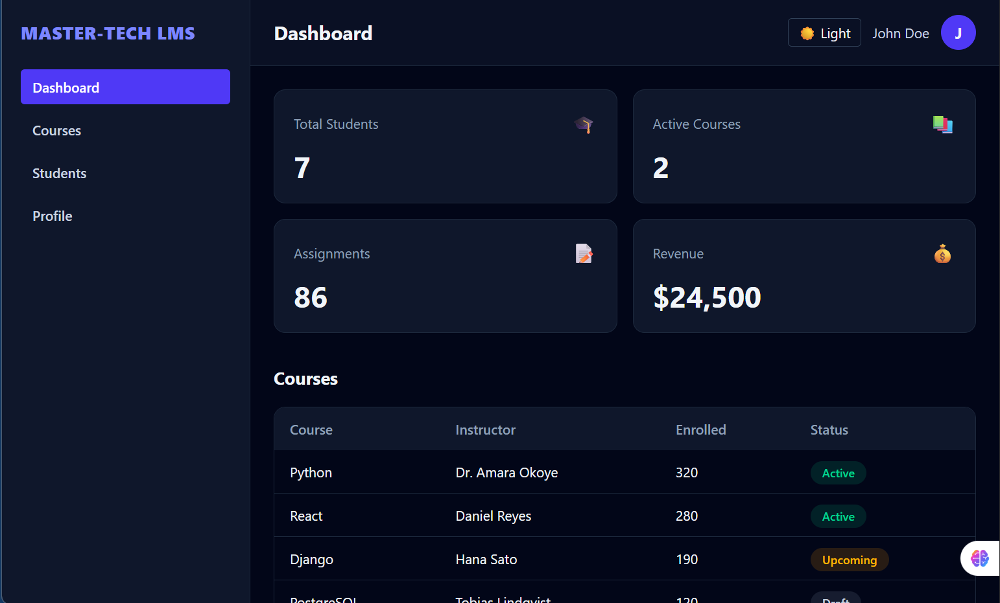

# Master-Tech LMS

A responsive frontend for a Learning Management System, built as the Week 8 React capstone for the Master-Tech Python Full Stack Bootcamp.

**Live demo:** [(https://lms-dashboard-lake.vercel.app/)]

](src/assets/image.png)

## Features

- Mock authentication: login, logout, protected routes and form validation
- Dashboard with live statistics, a course table and recent activity
- Courses page: reusable `CourseCard`, search, and an add-course form
- Students page: reusable `Table`, add / edit / delete, status filter and pagination
- Profile page with editable details shared across the app through a Zustand store
- Dark / light mode, remembered between visits
- Toast notifications
- Loading, empty and error states
- Responsive layout with a collapsible mobile sidebar
- Data saved in the browser (`localStorage`), so changes survive a refresh

## Tech Stack

React (Vite), React Router, Tailwind CSS v4, Zustand, Axios

## Project Structure

```text
src/
├── components/   reusable UI (Card, CourseCard, Table, Pagination, forms...)
├── pages/        Dashboard, Courses, Students, Profile, Login
├── layouts/      DashboardLayout
├── hooks/        useAuth, useFetch, useTheme
├── services/     api.js (all API calls live here)
├── context/      AuthContext
└── store/        userStore, studentStore, courseStore, toastStore (Zustand)
```

## Getting Started

```bash
git clone [YOUR REPO URL]
cd master-tech-lms
npm install
npm run dev
```

Open the local URL shown in the terminal.

**Demo login:** any valid email address and a password of 6 or more characters.

## Notes

- Authentication is **mocked**: a token is stored in `localStorage`.
- Students and courses are saved in `localStorage`, so they only exist in your own browser. To reset the data, clear `lms_students` and `lms_courses` in your browser's DevTools (Application → Local Storage).
- `services/api.js` holds the Axios instance and the API functions. It is ready to be pointed at a Django backend by setting `VITE_API_URL` and updating the functions there.

## Author

Ekwe Chika .A. (Piworld)